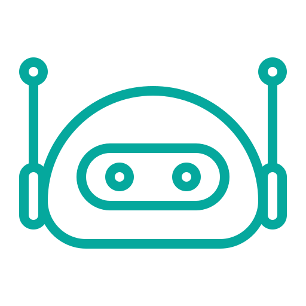
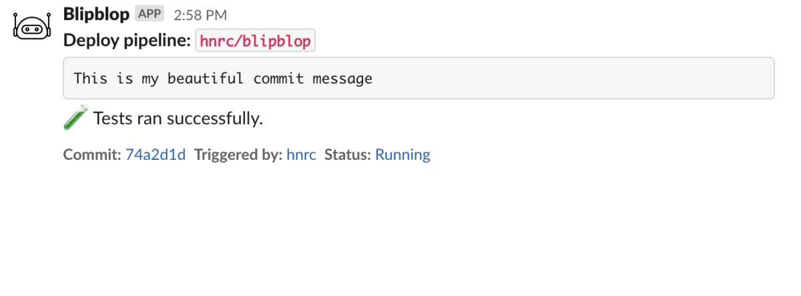
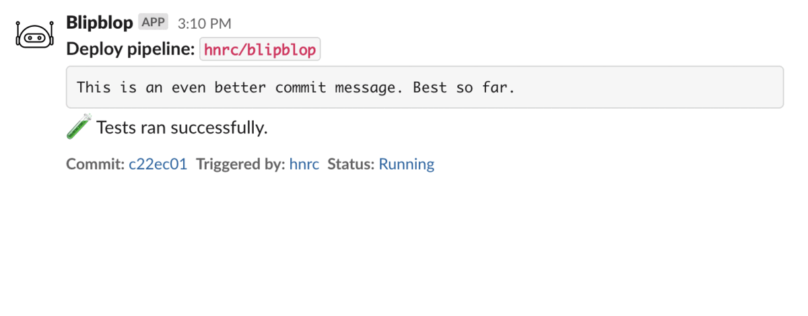

#  blip blop blip blop
###### _Opinionated yet flexible reusable Github Actions workflows built for an extraordinary developer experience._

This serves both as a showcase of what I consider to be an **extraordinarily good CI/CD developer experience** and as a reference **implementation of said experience**, using GitHub Actions as the underlying engine.

The reference implementation uses Google Cloud as the cloud provider and Google Kubernetes Engine as the container orchestrator, but that's a minor detail. The same flow and developer experience can be implemented regardless of the cloud provider or where the code ends up running.

## Table of contents

:rocket: [Reference implementation](#rocket-reference-implementation) 
:tophat: [Guiding principles](#tophat-guiding-principles) 
:notebook: [Frequently asked questions](#notebook-frequently-asked-questions) 
:raised_hands: [Acknowledgments](#raised_hands-acknowledgments)

## :rocket: Reference implementation

The reference implementation is built around a set of reusable workflows (or building blocks).

The building blocks are:

* [Run tests](.github/workflows/reusable-test.yaml)
* [Build container image](.github/workflows/reusable-build-docker.yaml)
* [Deploy to a Kubernetes cluster](.github/workflows/reusable-deploy.yaml)
* [Observe metrics](.github/workflows/reusable-observe-metrics.yaml)
  * _Currently only a mock but the intention is for it to integrate with some observability system_.

There are also a few reusable Actions, for [sending and formatting Slack messages](.github/actions/slack-post/action.yaml) and doing basic [string manipulation](.github/actions/string-replace/action.yaml).

By piecing these workflows together we can build custom (reusable) pipelines to our liking and taste.

The pre-built pipelines are:

### Continuous delivery (with manual approval in production)

Reusable workflow: [`reusable-pipeline-basic.yaml`](.github/workflows/reusable-pipeline-basic.yaml) 
Example usage: [`pipeline-basic.yaml`](.github/workflows/pipeline-basic.yaml)

This is pretty basic continuous delivery pipeline with automated deploys to a development environment and one-click deploys to production, typically after verifying that development works as expected.

The pipeline is triggered on every commit to the main branch. It goes through almost the entire pipeline without anyone having to touch anything. It only stops at the last step, the production deploy, which is guarded by a GitHub native _"environment protection rule"_. This means that someone has to approve the workflow before it can continue.

#### Progress in Slack

The entire progress of the pipeline is sent to Slack. The same Slack post is updated with additional info as the pipelines progresses, thus limiting the noise to a bare minimum while still providing all the nitty gritty details we care about.

The link saying `Click to approve production deploy` takes you to the running workflow on GitHub, where there's a button to approve the workflow.

### Continuous deployment (with canary releases in production)

Reusable workflow: [`reusable-pipeline-canary.yaml`](.github/workflows/reusable-pipeline-canary.yaml) 
Example usage: [`pipeline-canary.yaml`](.github/workflows/pipeline-canary.yaml)

This is a fully automated continuous deployment pipeline that uses canary releases to ensure we do not break production with a bad deploy.

It is set up similarly to the continuous delivery pipeline but instead of requiring someone to manually approve the production deploy, it deploys a canary release to _some_ percentage of production, fetches metrics from _some_ observability system, and uses that intelligence to decide if we should do a full-scale production deploy or revert the canary. No manual steps at all.

#### Progress in Slack

It looks a bit like this on Slack. All the info is in there, nicely formatted and to the point.

## :tophat: Guiding principles

There are some guiding principles connected to this work. Principles that drove the development of the reference implementation.

This is what it all pretty much bubbles down to:

### Commits to the main branch trigger the deploy pipeline which takes it all the way to production

The state of the main branch should at any given time reflect what's running in production. This effectively means that **all** changes, small or big, go out in production minutes after they have been merged.

Some of the neat effects of this are that:
* The **feedback loop from code merge to production is as short as it can possibly be**, within reason, which has many great effects in itself.
  * For example, _if_ there's an issue with our newly merged code, we probably have a lot of that context still in our brain and **can quickly jump into troubleshooting**. A feedback loop of say, hours, days or weeks typically means that we've moved on to other things and have a much harder time getting to the bottom of what's wrong.
* It **minimizes the risk** and fear that some people can have with doing production deploys. Specifically, because it ensures that what's about to be deployed is limited to our own changeset, the code we have written and know.
  * There's no risk of someone else's changes going out as part of our deployment.
  * This in turn means that the developer merging a piece of code **can take full responsibility and accountability**, in a good way, for what's about to be deployed, knows what to monitor, and, can act accordingly if something goes wrong.
* Dependency and library updates, done manually or automatically, are guaranteed to make it out in production, in **isolation rather than as a side effect** of other development.
  * This both lowers the risk and **ensures security fixes are applied** where it matters (in production).
  * A typical example is that a merged Dependabot PR will trigger a production deployment.

### Git hash is the only version indicator we need

Container image artifacts are tagged with the git hash. That's pretty much all we really care about, **a way of figuring out what version of the code is running** in a certain container.

There are plenty of other versioning techniques but they don't really make a lof of sense when we're striving for a fully automated, no fuss and highly continuous experience.

### The same build artifact is used in **all** environments

We don't build different container images for different environments. We use the **same image in all environments**, i.e. we use the same image in production as in all pre-production environments.

The reason for this is simple, we **want the pre-production and production environments to be [as similar as absolutly possible](https://12factor.net/dev-prod-parity)**.

### Manifests colocated with code

Colocating our Kubernetes manifests (or similar) with the actual code is a good way of keeping things together and is a **crucial building block when aiming to have a frictionless CI/CD developer experience**.

We would either have to jump through a lot of hoops or introduce manual steps if they were stored somewhere outside the code repo, which is the opposite of the developer experience we're aiming for.

### Multi-process apps

Our pipelines should natively have support for **bundling multiple "services" together** and deploy them as one "logical app".
In short, this means that an app can consist of multiple services/deployments, e.g. one responsible for doing HTTP traffic and one consuming messages from a queue.

This is beautiful in many ways. It isolates errors so that errors in for example a queue consumer don't cascade and take down the HTTP serving part of the app. It also makes it trivial to scale the different parts of the same "logical app" differently, e.g. give the HTTP serving other resource allocations than the queue consumer.

Read more about this process model here:
* https://12factor.net/processes
* https://12factor.net/concurrency

The important thing here is that our CI/CD pipelines natively support and encourage this way of modeling an app.

### Chat feedback (done right!)

We want the entire CI/CD pipeline to be piped to Slack (or any other chat tool).

This is table stakes, anyone can do a Slack integration but what most fail at is making this integration really really good.

**The Slack integration should be just as thought through** as the rest of the CI/CD pipeline.

What we want in there is info about what code we're about to deploy, where we are in the pipeline and we want it to be beautifully rendered and not add any unnecessary noise.

### Preview/PR apps

It has to be trivial to spin up preview/PR apps. That is, a dedicated app spun up when we open a PR from a feature branch. We typically also want the URL of that app posted as a comment in the PR.

This is a key capability nowadays and an extremely powerful feature when reviewing someone else's code, especially in web frontend projects.

It can be argued whether or not this should go under the CI/CD umbrella. Still, I'd argue it does, basically, because a feature like this typically taps into the other parts of the CI/CD pipeline and if the CI/CD system does not support this, people **will** come up with various hacky workarounds to achieve the same result, which is often not ideal.

### Same CI/CD process regardless of deploy target

This is an often (read: almost always) neglected but **very** important aspect of having a good CI/CD experience.
Most solutions are specifically designed for a very specific use case while in reality organizations often have different kinds of workloads they want to ship.

A few examples can be:
* Container deployments
* Cloud functions / Lambda functions
* CDN edge functions
* Airflow DAGs
* Other third-party runtimes

It's common for organizations to have different tools (and therefore workflows) for these different use cases, which is not great. What we want is to have **the same CI/CD experience regardless of deploy target**.

## :notebook: Frequently asked questions

#### _"– Can I use this in production?"_

Absolutely, there are some things that might need a bit of an adjustment (specifically the [observability stuff](.github/workflows/reusable-observe-metrics.yaml) if you're into canary releases) but in general, the bulk of this is production-grade.

#### _"– So okay, this is for GKE? We're on AWS/Azure/Digital Ocean/whatever."_

Most of this is platform agnostic. It should be fairly straightforward to massage the authentication parts to work with any other cloud provider, or with on-prem for that matter.

#### _"– I don't know about Github Actions..."_

GitHub Actions may not be the most sophisticated tool in the box but it does the job perfectly. Developers love it. It's right there, inside the tool you work with all day every day. It doesn't require any context switching. Also, come on, keep it simple.

Reusable workflows make it possible to scale this approach to hundreds and thousands of repositories.

#### _"– Meh, we're not using Github."_

Keep in mind that this is just a reference implementation. It's very possibly to port this to e.g. GitLab's CI/CD if you're on GitLab, or maybe CircleCI if you're into that.

## :raised_hands: Acknowledgments

Kudos to...

* [Robert Borowiec](https://github.com/robborow) for planting the seed about how to do a good Slack integration.
* [Zulfa Mahendra](https://www.flaticon.com/authors/zulfa-mahendra) for the robot icon.